# AISWO - Smart Bin Monitoring System

A comprehensive IoT-based smart bin monitoring system that provides real-time tracking, automated alerts, and intelligent data management for waste collection optimization.

## 📋 Table of Contents

- [Overview](#overview)
- [Features](#features)
- [System Architecture](#system-architecture)
- [Technology Stack](#technology-stack)
- [Installation & Setup](#installation--setup)
- [Firebase Configuration](#firebase-configuration)
- [API Documentation](#api-documentation)
- [Screenshots](#screenshots)
- [Workflow Diagrams](#workflow-diagrams)
- [Contributing](#contributing)
- [License](#license)

## 🎯 Overview

AISWO (AI Smart Waste Optimization) is an intelligent bin monitoring system that combines IoT hardware with web-based management interfaces. The system provides real-time monitoring of bin fill levels, automated operator notifications, weather-based alerts, and comprehensive data analytics for efficient waste management.

### Key Capabilities
- **Real-time Monitoring**: Live tracking of bin fill levels and weight
- **Smart Alerts**: Automated email notifications to assigned operators
- **Weather Integration**: Weather-based alerts for overflow prevention
- **Data Analytics**: Comprehensive statistics and reporting
- **Multi-bin Management**: Support for multiple bins with weighted data simulation
- **Admin Dashboard**: Complete system management interface

## ✨ Features

### 🔧 Core Functionality
- **Real-time Data Collection**: Hardware sensors send data to Firebase Realtime Database
- **Weighted Data Simulation**: Simulate multiple bins using single hardware data with configurable weight factors
- **Operator Management**: Assign operators to specific bins with contact information
- **Automated Notifications**: Email alerts sent to assigned operators when bins reach critical levels
- **Weather Monitoring**: Integration with OpenWeather API for weather-based alerts
- **Push Notifications**: FCM support for mobile notifications

### 📊 Dashboard Features
- **Bin Status Overview**: Real-time view of all bins with fill levels and status
- **Operator Management**: Add, edit, and manage operator information
- **Statistics Dashboard**: Comprehensive analytics and reporting
- **Weather Forecast**: Current weather conditions and forecasts
- **Admin Controls**: Complete system administration interface

### 🚨 Alert System
- **Fill Level Alerts**: Automatic notifications when bins exceed 80% capacity
- **Weather Alerts**: Rain warnings sent to all operators
- **Email Notifications**: Detailed alerts with bin information and location
- **Push Notifications**: Mobile alerts via Firebase Cloud Messaging

## 🏗️ System Architecture

The AISWO system follows a modern microservices architecture with clear separation of concerns:

```
┌─────────────────┐    ┌─────────────────┐    ┌─────────────────┐
│   IoT Hardware  │    │   Frontend      │    │   Backend       │
│   (Arduino/ESP) │    │   (React)       │    │   (Node.js)     │
└─────────────────┘    └─────────────────┘    └─────────────────┘
         │                       │                       │
         │                       │                       │
         ▼                       ▼                       ▼
┌─────────────────┐    ┌─────────────────┐    ┌─────────────────┐
│ Firebase        │    │ Admin Dashboard │    │ REST API        │
│ Realtime DB     │    │ Bin Dashboard   │    │ Email Service   │
└─────────────────┘    └─────────────────┘    └─────────────────┘
         │                       │                       │
         │                       │                       │
         ▼                       ▼                       ▼
┌─────────────────┐    ┌─────────────────┐    ┌─────────────────┐
│ Firestore       │    │ Weather API     │    │ FCM Service     │
│ (Operators/Bins)│    │ (OpenWeather)   │    │ (Push Notifs)   │
└─────────────────┘    └─────────────────┘    └─────────────────┘
```

## 🛠️ Technology Stack

### Frontend
- **React.js**: Modern UI framework
- **CSS3**: Custom styling with CSS variables
- **Axios**: HTTP client for API communication
- **Firebase SDK**: Client-side Firebase integration

### Backend
- **Node.js**: Server runtime
- **Express.js**: Web framework
- **Firebase Admin SDK**: Server-side Firebase integration
- **Nodemailer**: Email service
- **Axios**: HTTP client for external APIs

### Database & Services
- **Firebase Realtime Database**: Real-time hardware data
- **Firebase Firestore**: Persistent data storage
- **Firebase Cloud Messaging**: Push notifications
- **OpenWeather API**: Weather data integration
- **Gmail SMTP**: Email delivery service

### Hardware
- **Arduino/ESP32**: IoT microcontroller
- **Weight Sensors**: Load cells for weight measurement
- **Ultrasonic Sensors**: Distance measurement for fill level
- **WiFi Module**: Internet connectivity

## 🚀 Installation & Setup

### Prerequisites
- Node.js (v14 or higher)
- npm or yarn
- Firebase project
- Gmail account with app password
- OpenWeather API key (free tier available)
- Gemini AI API key (free tier available)

### Backend Setup

1. **Clone the repository**
   ```bash
   git clone https://github.com/yourusername/aiswo-fyp.git
   cd aiswo-fyp/aiswo-backend
   ```

2. **Install dependencies**
   ```bash
   npm install
   ```

3. **Configure environment variables**
   Create a `.env` file in the `aiswo-backend` directory:
   ```env
   # OpenWeather API Key for weather data and alerts
   OPENWEATHER_API_KEY=your_openweather_api_key_here
   
   # Gemini AI API Key for chatbot functionality
   GEMINI_API_KEY=your_gemini_api_key_here
   ```

   **Getting API Keys:**

   **OpenWeather API Key:**
   1. Go to [OpenWeatherMap](https://openweathermap.org/api)
   2. Sign up for a free account
   3. Navigate to "API keys" section
   4. Copy your API key
   5. Add it to the `.env` file

   **Gemini AI API Key:**
   1. Go to [Google AI Studio](https://makersuite.google.com/)
   2. Sign in with your Google account
   3. Create a new API key
   4. Copy the generated key
   5. Add it to the `.env` file

   **Important Notes:**
   - Never commit the `.env` file to version control
   - The `.env` file is already included in `.gitignore`
   - Keep your API keys secure and don't share them publicly
   - Free tier limits apply to both services

   **What happens without API keys:**
   - **OpenWeather API**: Weather alerts and forecasts will be disabled
   - **Gemini API**: Chatbot functionality will be unavailable
   - **Core functionality**: Bin monitoring and email alerts will still work

4. **Start the server**
   ```bash
   npm start
   ```

### Frontend Setup

1. **Navigate to frontend directory**
   ```bash
   cd ../aiswo_frontend
   ```

2. **Install dependencies**
   ```bash
   npm install
   ```

3. **Start the development server**
   ```bash
   npm start
   ```

## 🔥 Firebase Configuration

### 1. Create Firebase Project
1. Go to [Firebase Console](https://console.firebase.google.com/)
2. Click "Create a project"
3. Name your project (e.g., "aiswo-simple")
4. Enable Google Analytics (optional)
5. Create the project

### 2. Enable Required Services

#### Realtime Database
1. Go to "Realtime Database"
2. Click "Create Database"
3. Choose "Start in test mode"
4. Select location: **Asia-Southeast1**
5. Note the database URL

#### Firestore Database
1. Go to "Firestore Database"
2. Click "Create database"
3. Choose "Start in test mode"
4. Select same location as Realtime Database

### 3. Generate Service Account Key
1. Go to Project Settings → Service accounts
2. Click "Generate new private key"
3. Download the JSON file
4. Rename to `serviceAccountKey.json`
5. Place in `aiswo-backend` folder

### 4. Security Rules (Development)

#### Firestore Rules
```javascript
rules_version = '2';
service cloud.firestore {
  match /databases/{database}/documents {
    match /{document=**} {
      allow read, write: if true; // Only for development!
    }
  }
}
```

#### Realtime Database Rules
```json
{
  "rules": {
    ".read": true,
    ".write": true
  }
}
```

## 📚 API Documentation

### Base URL
```
http://localhost:5000
```

### Endpoints

#### Health Check
```http
GET /health
```
Returns server status and uptime.

#### Bins Management
```http
GET /bins
```
Get all bins with real-time data and weighted simulations.

```http
GET /bins/:id
```
Get specific bin data.

```http
POST /bins
```
Create new bin.

```http
PUT /bins/:id
```
Update bin information.

```http
DELETE /bins/:id
```
Delete bin.

#### Operators Management
```http
GET /operators
```
Get all operators.

```http
GET /operators/:id
```
Get specific operator.

```http
POST /operators
```
Create new operator.

```http
PUT /operators/:id
```
Update operator information.

```http
DELETE /operators/:id
```
Delete operator.

#### Statistics
```http
GET /stats
```
Get system statistics and analytics.

## 📸 Screenshots

### 1. Landing Page

*Welcome page showcasing the AISWO Smart Bin Monitoring System*

### 2. Bin Dashboard

*Real-time monitoring dashboard showing bin status and fill levels*

### 3. Admin Dashboard - Bins Management

*Administrative interface for managing bins and their configurations*

### 4. Admin Dashboard - Operators Management

*Operator management interface for assigning and managing staff*

### 5. Weather Forecast

*Weather monitoring interface with current conditions and forecasts*

## 🔄 Workflow Diagrams

### Data Flow Architecture


### Alert System Workflow


### Weighted Data Generation Process

```mermaid
graph LR
    A[Real Hardware Data<br/>bin1] --> B[Weight Factor<br/>0.3, 0.5, 0.7, etc.]
    B --> C[Apply Weight<br/>weightKg × factor]
    C --> D[Add Variation<br/>±10% random]
    D --> E[Generate Status<br/>Normal/Warning/Full]
    E --> F[Create Bin Data<br/>bin2, bin3, bin4...]
    F --> G[Store in Firestore]
    G --> H[Return to Frontend]
```


### User Management Workflow


## 🎛️ Configuration

### Weight Factors
The system uses configurable weight factors to simulate multiple bins from single hardware:

```javascript
const WEIGHT_FACTORS = {
  bin2: 0.3,  // 30% of real data
  bin3: 0.5,  // 50% of real data
  bin4: 0.7,  // 70% of real data
  bin5: 0.4,  // 40% of real data
  bin6: 0.6   // 60% of real data
};
```

### Email Configuration
```javascript
const transporter = nodemailer.createTransport({
  service: "gmail",
  auth: {
    user: "your-email@gmail.com",
    pass: "your-app-password"
  }
});
```

### Alert Thresholds
- **Critical Alert**: >80% fill level
- **Warning Alert**: 60-80% fill level
- **Normal**: <60% fill level

## 🧪 Testing

### Manual Testing
1. **Start both servers** (backend and frontend)
2. **Access the application** at `http://localhost:3000`
3. **Test bin management** by adding/editing bins
4. **Test operator management** by adding operators
5. **Verify email alerts** by checking bin fill levels
6. **Test weather alerts** by monitoring weather conditions

### API Testing
Use tools like Postman or curl to test API endpoints:

```bash
# Test health endpoint
curl http://localhost:5000/health

# Test bins endpoint
curl http://localhost:5000/bins

# Test operators endpoint
curl http://localhost:5000/operators
```

## 🚀 Deployment

### Production Considerations
1. **Update security rules** for Firebase
2. **Use environment variables** for sensitive data
3. **Implement proper authentication**
4. **Set up monitoring and logging**
5. **Configure SSL certificates**
6. **Set up backup strategies**

### Environment Variables
```env
# Production Environment
NODE_ENV=production
FIREBASE_PROJECT_ID=your-project-id
FIREBASE_PRIVATE_KEY=your-private-key
FIREBASE_CLIENT_EMAIL=your-client-email
OPENWEATHER_API_KEY=your-api-key
GEMINI_API_KEY=your-api-key
```

## 🤝 Contributing

1. Fork the repository
2. Create a feature branch (`git checkout -b feature/amazing-feature`)
3. Commit your changes (`git commit -m 'Add some amazing feature'`)
4. Push to the branch (`git push origin feature/amazing-feature`)
5. Open a Pull Request

### Development Guidelines
- Follow the existing code style
- Add comments for complex logic
- Update documentation for new features
- Test your changes thoroughly
- Ensure backward compatibility

## 📄 License

This project is licensed under the MIT License - see the [LICENSE](LICENSE) file for details.

## 📞 Support

For support and questions:
- Create an issue in the GitHub repository
- Contact the development team
- Check the documentation and FAQ

## 🙏 Acknowledgments

- Firebase for providing excellent backend services
- OpenWeather API for weather data
- The React community for amazing tools and libraries
- All contributors who helped make this project possible

---

**AISWO - Making Waste Management Smarter** 🗑️✨